<!--
  PROFILE README — generated for siddharthkmaharana
  This must live in a public repo named EXACTLY your GitHub username
  (github.com/siddharthkmaharana/siddharthkmaharana) to render on your profile.
-->

 
 

<!-- animated contribution snake: eats real GitHub commits, auto-refreshed daily via snake.yml -->

<picture>
  <source media="(prefers-color-scheme: dark)" srcset="https://raw.githubusercontent.com/siddharthkmaharana/siddharthkmaharana/output/github-contribution-grid-snake-dark.svg">
  <source media="(prefers-color-scheme: light)" srcset="https://raw.githubusercontent.com/siddharthkmaharana/siddharthkmaharana/output/github-contribution-grid-snake.svg">
  
</picture>

 
 

<h3><code>siddharthkmaharana@github ~ $ ./links.sh</code></h3>

<b>MCA Student · Full Stack Developer · AI Builder</b>

 

